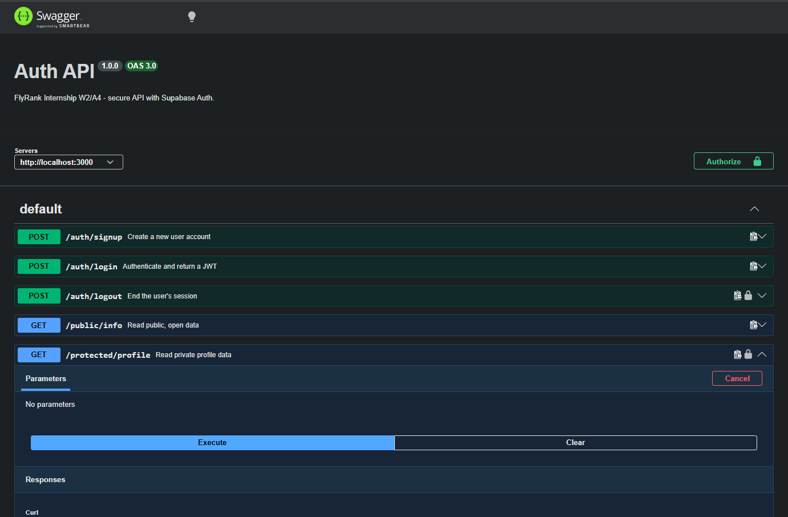
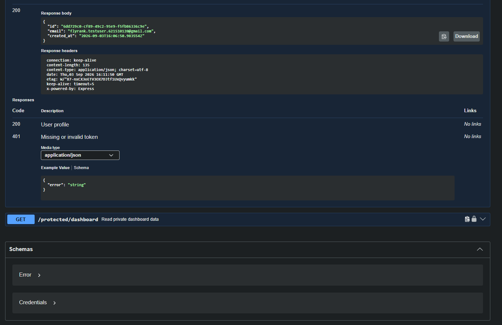

# Auth API — Login & Protect

FlyRank Internship · Backend Track · Week 2 · Assignment A4

A secure Express API using **Supabase Auth** as the Identity Provider. It handles
sign up, log in, and log out, verifies JSON Web Tokens issued by Supabase, and
protects private routes behind a reusable middleware guard. No password hashing
or cryptography is implemented here — Supabase handles that; this server only
forwards credentials and verifies the tokens Supabase hands back.

## Setup

1. Create a free project at [supabase.com](https://supabase.com).
2. In **Project Settings → API**, copy your **Project URL** and **anon key**
   (never the `service_role` key).
3. In **Authentication → Sign In / Providers → Email**, turn off "Confirm email"
   so a fresh signup can log in immediately (practice-project setting only).
4. Copy `.env.example` to `.env` and fill in your values:

```
SUPABASE_URL=your_project_url
SUPABASE_KEY=your_anon_key
PORT=3000
```

5. Install dependencies:

```
npm install
```

## Run

```
npm start
```

Server starts on `http://localhost:3000` and logs a message confirming it's
connected to Supabase.

## API reference

| Route | Method | Purpose | Auth required | Success status |
|---|---|---|---|---|
| `/auth/signup` | POST | Create a new user account | none | 201 |
| `/auth/login` | POST | Authenticate and return a JWT | none | 200 |
| `/auth/logout` | POST | End the user's session | `Authorization: Bearer <token>` | 204 |
| `/protected/profile` | GET | Read private profile data | `Authorization: Bearer <token>` | 200 |
| `/protected/dashboard` | GET | Read private dashboard data | `Authorization: Bearer <token>` | 200 |
| `/public/info` | GET | Read public, open data | none | 200 |

Errors return `400` (missing input) or `401` (missing/malformed/invalid/expired
token), each with a JSON `{ "error": "..." }` body.

## Testing with curl

```
curl -i -X POST http://localhost:3000/auth/signup \
  -H "Content-Type: application/json" \
  -d '{"email":"test@example.com","password":"password123"}'

curl -i -X POST http://localhost:3000/auth/login \
  -H "Content-Type: application/json" \
  -d '{"email":"test@example.com","password":"password123"}'

curl -i http://localhost:3000/protected/profile \
  -H "Authorization: Bearer <PASTE_ACCESS_TOKEN_HERE>"
```

## Swagger UI

Interactive docs are served at [http://localhost:3000/docs](http://localhost:3000/docs).
Protected routes show a lock icon; click **Authorize**, paste an access token,
then **Try it out** on `GET /protected/profile`.




## Architecture notes

- `supabaseClient.js` — initializes the Supabase client from environment
  variables.
- `authMiddleware.js` — `requireAuth`, the reusable guard: extracts the bearer
  token, calls `supabase.auth.getUser(token)`, and either attaches `req.user`
  or responds `401`. Applied to `/auth/logout`, `/protected/profile`, and
  `/protected/dashboard`.
- `index.js` — routes and validation.
- `openapi.json` — OpenAPI spec with a `bearerAuth` security scheme, served via
  `swagger-ui-express` at `/docs`.
