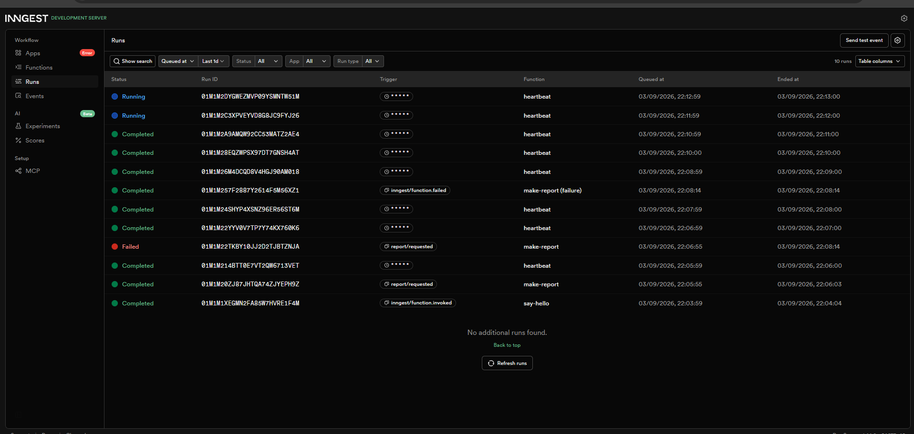

# Background Job API

FlyRank Internship · Backend Track · Week 4 · Assignment A7

A small Express API whose slow work runs in the background via **Inngest**.
The API answers instantly, a status endpoint reports progress, and a cron
job runs on the clock alone.

## Run it

Two terminals, two commands.

```
npm install
npm start
```

```
npx inngest-cli@latest dev -u http://localhost:3000/api/inngest
```

Dashboard: http://localhost:8288
API: http://localhost:3000

## Endpoints and functions

| Route / Function | Trigger | Purpose | Response |
|---|---|---|---|
| `GET /health` | HTTP | Liveness check | 200 |
| `POST /reports` | HTTP | Accept a report request, hand off the slow work | 202 + `{ id, status }`, or 400 if `topic` missing |
| `GET /reports/:id` | HTTP | Poll report status | `pending` / `done` + result, 404 if unknown |
| `say-hello` (Inngest fn) | event `test/hello` | Stage 1 wiring check, sleeps 5s | - |
| `make-report` (Inngest fn) | event `report/requested` | Sleeps 8s, then builds the report; retries 2x on failure | - |
| `heartbeat` (Inngest fn) | cron `* * * * *` | Logs pending/done/failed counts every minute | - |

## Proof: 202 now, done later

```
> curl -i -X POST http://localhost:3000/reports -H "Content-Type: application/json" -d '{"topic":"cats"}'
HTTP/1.1 202 Accepted
{"id":"mtlqy8mva7ugwc","status":"pending"}
# elapsed: 356 ms

> curl -i http://localhost:3000/reports/mtlqy8mva7ugwc
{"id":"mtlqy8mva7ugwc","topic":"cats","status":"pending"}

# ~9 seconds later:
> curl -i http://localhost:3000/reports/mtlqy8mva7ugwc
{"id":"mtlqy8mva7ugwc","topic":"cats","status":"done","result":"Report on \"cats\": cats is a great topic with 3 key insights."}
```

## Stage 3 - retries vs validation

A missing `topic` is a client mistake, not a temporary glitch, so `POST
/reports` rejects it immediately with `400` and never sends an event - no job
is ever created for bad input. A `topic: "fail"` request, by contrast, is
accepted normally (the input is valid) and fails *inside* the background
function, so Inngest retries it automatically with backoff (observed waits:
~20s, ~39s, ~59s) before giving up after 3 total attempts and marking the run
`Failed`.

## Stage 4 - cron

The `heartbeat` function runs on `* * * * *` (every minute, for testing) and
just logs how many reports are `pending`, `done`, and `failed` - no request
or event starts it, only the clock.

- Every day at 08:00: `0 8 * * *`
- Every Sunday at 22:00: `0 22 * * 0`

(built and checked on crontab.guru)

## Dashboard screenshot


