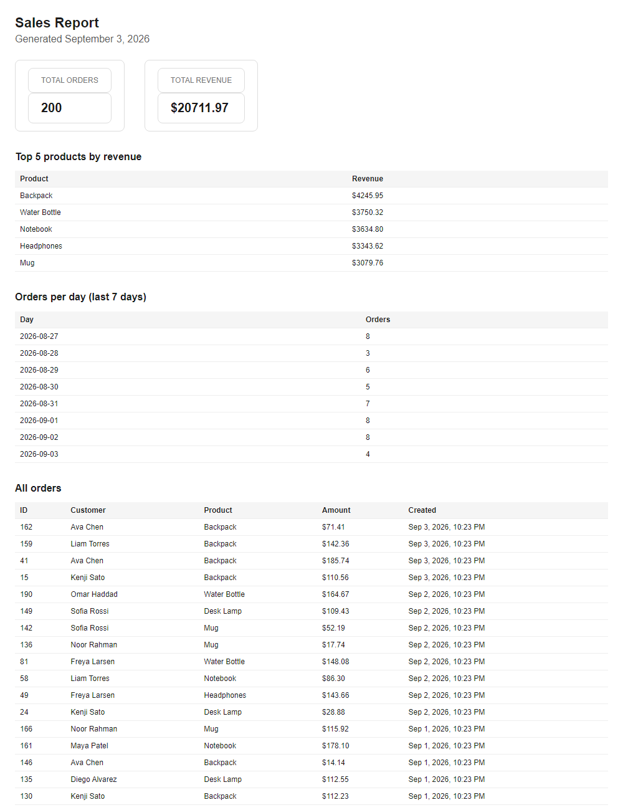

# PDF Report Generator (FlyRank W4/A8)

Query your data with SQL, render it into a real PDF report, and hand it out
by link. No background jobs required — the whole pipeline runs inside a
plain endpoint.

## What this is

A small Express API backed by SQLite (`report.db`). It seeds ~200 fake shop
orders, aggregates them into a report (totals, top products, a daily
breakdown), renders that report to a PDF with Playwright/headless Chromium,
stores the file on disk, and serves it by link. Generating twice on the same
day returns the same report instead of creating a duplicate.

Dataset chosen: **Option A — the little shop** (seeded orders, not the A9
scraper data).

## How to run

```bash
npm install
npx playwright install chromium   # one-time, downloads headless Chromium
npm run seed                      # fills report.db with ~200 orders
npm start                         # starts the API on http://localhost:3000
```

Re-running `npm run seed` is safe — it deletes existing rows first, so the
count never doubles.

## Aggregation SQL

The four numbers behind the report (`report.js`):

```sql
-- Total orders
SELECT COUNT(*) AS totalOrders FROM orders;

-- Total revenue
SELECT SUM(amount) AS totalRevenue FROM orders;

-- Top 5 products by revenue
SELECT product, SUM(amount) AS revenue
FROM orders
GROUP BY product
ORDER BY revenue DESC
LIMIT 5;

-- Orders per day, last 7 days
SELECT date(created_at) AS day, COUNT(*) AS count
FROM orders
WHERE date(created_at) >= date('now', '-7 days')
GROUP BY day
ORDER BY day;
```

## Endpoints

| Method | Path | Description | Success | Errors |
|---|---|---|---|---|
| GET | `/health` | Health check | 200 | — |
| POST | `/reports` | Generate a report (or return today's existing one) | 201 (new) / 200 (existing) | — |
| GET | `/reports/:id` | Report record + file link | 200 | 404 |
| GET | `/reports/:id/file` | Download the PDF | 200 (file) | 404 |

## Generate → download proof

```bash
$ curl -i -X POST http://localhost:3000/reports
HTTP/1.1 201 Created
Content-Type: application/json

{"id":2,"file":"/reports/2/file"}

$ curl -o my-report.pdf http://localhost:3000/reports/2/file
# my-report.pdf opens as a real 6-page PDF
```

## Stage 4 — feel the wait

The POST takes a little over a second on this machine (query + render +
write to disk, all inside the request). For one user clicking one button
that's fine. I'd move this into a background job once either the report
gets big enough that rendering takes several seconds, or once more than a
handful of users could be generating reports at the same time — at that
point a slow POST starts blocking the server's other work and holding users
hostage waiting on a response.

## Stage 5 — ask twice, get one

`POST /reports` checks whether a report was already generated today before
rendering a new one; if so it returns the existing `id` and link with `200`
instead of generating (and paying for) a second one. This protects against
the classic double-click: a user impatiently re-clicking "Generate report"
should get their one file, not silently trigger two full PDF renders in the
background. A real-world example with actual cost: a nightly invoicing job
that isn't idempotent could double-charge a customer's card if the request
gets retried after a timeout.

## Duplicate-request proof

```bash
$ curl -s -X POST http://localhost:3000/reports
{"id":2,"file":"/reports/2/file"}
$ curl -s -X POST http://localhost:3000/reports
{"id":2,"file":"/reports/2/file"}
```

Same `id` both times, and `reports/` gained no new file for the second call.
Passing `{ "force": true }` in the body skips the check and always renders a
fresh report with a new id.

## Report screenshot (page 1)



## Notes

- `reports/` and `report.db` are gitignored — generated artifacts and
  databases don't belong in Git. `seed.js` is the recipe that recreates the
  data.
- Every database line lives in `db.js`, `report.js`, and `render.js`; the
  routes in `index.js` only orchestrate the pipeline.
