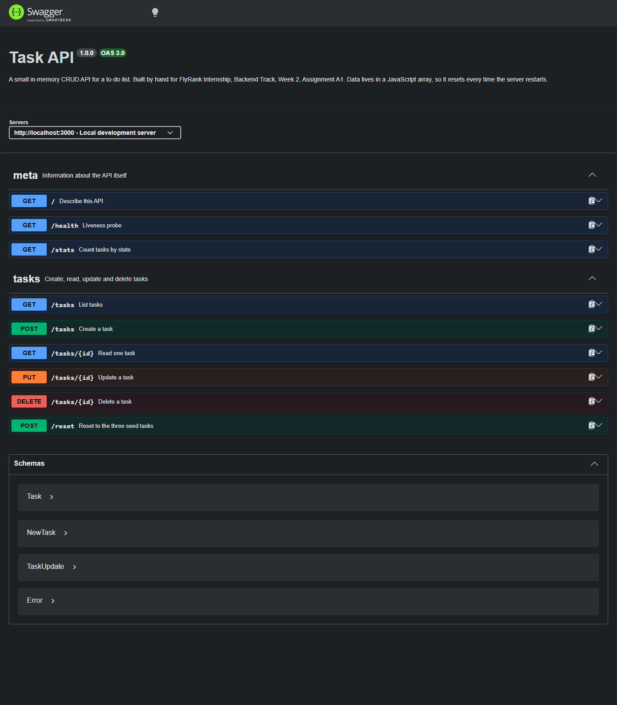

# Task API — a hand-built CRUD API

FlyRank Internship · Backend Track · Week 2 · Assignment A1 · **JavaScript lane**

A small REST API that manages a to-do list: create, read, update and delete
tasks. Built with Node.js and Express. There is no database — the tasks live in
a plain JavaScript array, so the list resets every time the server restarts.
That is on purpose (see [The mortality experiment](#the-mortality-experiment)).

Interactive docs are served at **http://localhost:3000/docs** by Swagger UI,
generated from the hand-written [`openapi.json`](openapi.json).

---

## Install & run

You need [Node.js](https://nodejs.org) 18 or newer. Then:

```bash
npm install
npm start
```

That's the one command: `npm start`. The server listens on
**http://localhost:3000** and prints the URL when it's ready.

Open http://localhost:3000/docs to poke at every endpoint from the browser.

---

## Endpoints

| Method   | Path         | What it does                    | Success | Errors                            |
| -------- | ------------ | ------------------------------- | ------- | --------------------------------- |
| `GET`    | `/`          | Describes this API              | `200`   | —                                 |
| `GET`    | `/health`    | Liveness probe                  | `200`   | —                                 |
| `GET`    | `/stats`     | Counts total / done / open      | `200`   | —                                 |
| `GET`    | `/tasks`     | Lists tasks (filter, search, paginate) | `200` | `400` bad query parameter    |
| `POST`   | `/tasks`     | Creates a task                  | `201`   | `400` missing/empty/invalid title |
| `GET`    | `/tasks/:id` | Reads one task                  | `200`   | `404` unknown id                  |
| `PUT`    | `/tasks/:id` | Updates title and/or done       | `200`   | `400` empty/invalid body · `404` unknown id |
| `DELETE` | `/tasks/:id` | Deletes a task (empty body)     | `204`   | `404` unknown id                  |
| `POST`   | `/reset`     | Restores the 3 seed tasks       | `200`   | —                                 |
| `GET`    | `/docs`      | Swagger UI                      | `200`   | —                                 |
| `GET`    | `/openapi.json` | The raw OpenAPI spec         | `200`   | —                                 |

A task looks like this:

```json
{ "id": 1, "title": "Read MDN on HTTP", "done": true }
```

Every error response is JSON, never HTML:

```json
{ "error": "Task 99 not found" }
```

### Query parameters on `GET /tasks`

| Parameter | Example                    | Effect                                        |
| --------- | -------------------------- | --------------------------------------------- |
| `done`    | `/tasks?done=true`         | Only finished (or only unfinished) tasks      |
| `search`  | `/tasks?search=milk`       | Only tasks whose title contains the text      |
| `limit`   | `/tasks?limit=2`           | At most this many tasks                       |
| `offset`  | `/tasks?limit=2&offset=2`  | Skip this many first — that's pagination       |

**Why real APIs never return "everything":** a list endpoint that always
returns the whole table is a bomb with a delay fuse. It works fine on 3 rows
and falls over on 3 million — the query gets slow, the JSON gets huge, the
client runs out of memory, and one careless caller can take the server down.
Pagination caps the cost of a single request, so response time stays roughly
constant no matter how much data you're storing.

---

## Proof it works: `curl -i`

Full transcript in [`docs/curl-session.txt`](docs/curl-session.txt). The
interesting parts:

```console
$ curl -i http://localhost:3000/tasks/1
HTTP/1.1 200 OK
Content-Type: application/json; charset=utf-8
Content-Length: 47

{"id":1,"title":"Read MDN on HTTP","done":true}

$ curl -i http://localhost:3000/tasks/99
HTTP/1.1 404 Not Found
Content-Type: application/json; charset=utf-8

{"error":"Task 99 not found"}

$ curl -i -X POST http://localhost:3000/tasks -H "Content-Type: application/json" -d '{"title":"Buy milk"}'
HTTP/1.1 201 Created
Content-Type: application/json; charset=utf-8

{"id":4,"title":"Buy milk","done":false}

$ curl -i -X POST http://localhost:3000/tasks -H "Content-Type: application/json" -d '{}'
HTTP/1.1 400 Bad Request
Content-Type: application/json; charset=utf-8

{"error":"Field 'title' is required"}

$ curl -i -X PUT http://localhost:3000/tasks/4 -H "Content-Type: application/json" -d '{"done":true}'
HTTP/1.1 200 OK
Content-Type: application/json; charset=utf-8

{"id":4,"title":"Buy milk","done":true}

$ curl -i -X DELETE http://localhost:3000/tasks/4
HTTP/1.1 204 No Content
```

> On Windows PowerShell, write the body as `-d '{"title":"Buy milk"}'` with
> single quotes and **no** backslashes. Escaping the inner quotes the way you
> would in `cmd.exe` sends literal backslashes and earns you a `400`.

---

## Swagger UI

`http://localhost:3000/docs` — every endpoint listed, each with a **Try it out**
button that fires real requests. The whole CRUD cycle (create → list → update →
delete) was driven through this page, not just through curl.



---

## The mortality experiment

Created a fourth task, restarted the server, then asked for the list again:

```console
$ curl -s http://localhost:3000/stats          # before restart
{"total":4,"done":1,"open":3}

$ curl -s http://localhost:3000/tasks          # after restart
[{"id":1,...},{"id":2,...},{"id":3,...}]       # the fourth task is gone
```

The task vanished because it only ever existed in the `tasks` array inside the
Node process, and killing the process threw that memory away — nothing was ever
written anywhere durable. This is exactly the hole a database fills: it keeps
data on disk, outside the lifetime of the program that created it.

---

## AI vs me

I built stages 0–6 by hand first, then asked an AI assistant to build the same
API so I could review it. The AI code lives in
[`ai-version/`](ai-version/) and is never imported by the hand-built API.

- My prompts (attempt 1 and the rematch): [`docs/ai-prompt.md`](docs/ai-prompt.md)
- AI attempt 1: [`ai-version/server.js`](ai-version/server.js) (port 4000)
- AI rematch: [`ai-version/server-rematch.js`](ai-version/server-rematch.js) (port 4001)
- The harness I fired at all three: [`docs/compare.mjs`](docs/compare.mjs)

Setup detail: the AI used here was Kiro (Claude Opus 5), prompted from
`docs/ai-prompt.md`. Its output is committed unedited so the diff stays honest.

```bash
node ai-version/server.js            # then, in another terminal:
node docs/compare.mjs ai             # 15 requests, prints status + body
node docs/compare.mjs mine           # the same 15 against the hand-built API
```

### Did it start on the first try?

Yes. `node ai-version/server.js` came up on port 4000 with no syntax errors, and
`/docs` rendered. The four happy paths all passed. The failures were all in the
edges.

### Results: same 15 requests, three servers

| # | Request | Expected | Mine | AI attempt 1 | AI rematch |
|---|---------|----------|------|--------------|-----------|
| 1 | `GET /tasks` | 200 | 200 | 200 | 200 |
| 2 | `GET /tasks/99` | 404 | 404 | 404 | 404 |
| 3 | `POST {"title":"Buy milk"}` | 201 | 201 | 201 | 201 |
| 4 | `POST {}` | 400 | 400 | 400 | 400 |
| 5 | `POST {"title":123}` | 400 | 400 | **201** ❌ | 400 |
| 6 | `POST {"title":"   "}` | 400 | 400 | **201** ❌ | 400 |
| 7 | `PUT {"done":true}` (partial) | 200 | 200 | **400** ❌ | 200 |
| 8 | `PUT {}` | 400 | 400 | 400 | 400 |
| 9 | `PUT {"done":"yes"}` | 400 | 400 | **200** ❌ | 400 |
| 10 | `GET /nope` | 404 JSON | 404 JSON | **404 HTML** ❌ | 404 JSON |
| 11 | `POST` malformed JSON | 400 JSON | 400 JSON | **400 HTML** ❌ | 400 JSON |
| 12 | `DELETE /tasks/4` | 204 | 204 | 204 | 204 |
| 13 | `POST` after that delete | fresh id | id 5 | **duplicate id 6** ❌ | id 5 |
| 14 | `GET /tasks` | consistent | ✔ | ✔ | ✔ |
| 15 | `GET /docs` | 200 | 200 | 200 | 200 |

**Score: mine 15/15, AI attempt 1 nine of 15, AI rematch 15/15.**

### What did the AI do *better*?

Honestly: it was **shorter and easier to skim**. `git diff --no-index index.js
ai-version/server.js` reports 246 of my lines replaced by 123 of its lines. Some
of that gap is my comments and my extras, but not all of it — its handlers are
genuinely tighter. Two things I'd actually adopt:

- **One-line guard clauses.** It writes
  `if (!task) return res.status(404).json({ error: ... });` on a single line.
  Mine spans four. Over five handlers that's a lot of vertical noise for no
  extra meaning.
- **It skipped my `parseId` helper** and just used `Number(req.params.id)`
  inline. I can explain why mine is stricter — `parseInt("3abc")` returns `3`,
  so `/tasks/3abc` would resolve to task 3, whereas my regex rejects it — but
  its version is 8 lines shorter and covers the realistic cases.

I can explain every line of its version, including the parts that are wrong.
That's the whole point of having built mine first.

### What did it get *wrong* or quietly ignore?

Six concrete defects, all reproducible with `node docs/compare.mjs ai`:

1. **`PUT` isn't a partial update.** It does `if (!title) return 400`, so
   `{"done":true}` — the single most common update in a to-do app, ticking a
   box — is rejected with `{"error":"Title is required"}`. My prompt said
   "title and/or done" and it read that as "title, and optionally done".
2. **No type checking.** `{"title":123}` is accepted and stored as a number,
   because `!123` is `false`. `{"done":"yes"}` is stored as the *string* `"yes"`.
   The API now returns tasks that violate its own documented schema.
3. **Whitespace counts as a title.** `{"title":"   "}` passes, because
   `"   ".length` is 3. It never trims.
4. **Unknown routes return HTML.** `GET /nope` gets Express' default HTML 404,
   even though I explicitly wrote "every error response must be JSON, never
   HTML". It added no catch-all.
5. **Malformed JSON returns a 1 KB HTML stack trace** — same instruction
   ignored, and it leaks absolute file paths from my machine into the response.
   I hit this exact bug in my own build at Stage 3 and fixed it; it's the reason
   I knew to test for it.
6. **Ids get reused.** `id: tasks.length + 1` is the classic bug. Delete a task,
   create another, and you get **two tasks with id 6** — after which
   `GET /tasks/6` and `DELETE /tasks/6` silently pick whichever comes first.

Also quietly decided for me, without asking: it renamed the API to "Todo API",
invented its own three seed tasks, and wrote a much thinner OpenAPI spec —
summaries and status codes but no schemas, no examples, no error bodies. It
technically satisfies "serve Swagger UI at /docs" while giving up most of what
makes the page useful.

### What did *my prompt* forget to specify?

Every one of those six defects traces back to a gap in my own wording, not to
laziness on the model's part:

- I wrote "change a task's title and/or done" — informal English. I never said
  **"omitted fields must keep their current value"**, which is the actual rule.
- I said the title must not be "missing or empty". I never defined **empty**
  (is `"   "` empty?) or said anything about **types**. It had to guess, and it
  guessed with `!title` — a JavaScript truthiness check, which is exactly the
  guess a JavaScript-flavoured prompt invites.
- I said error responses must be JSON, but only ever discussed errors *inside my
  five endpoints*. I never said "including requests that don't match any route,
  and including bodies that fail to parse".
- I never mentioned ids at all beyond "the server picks the id". `length + 1`
  satisfies that sentence perfectly. It's still a bug.

### The one rematch

I rewrote the prompt with those four gaps closed (attempt 2 in
`docs/ai-prompt.md`) and regenerated. **What changed: the rematch passes all 15
checks — partial `PUT`, type rejection, trimmed titles, JSON-only errors and
monotonic ids all appeared, because this time I asked for them in words instead
of assuming they were obvious.**

The takeaway isn't "AI is unreliable". It's that the model wrote precisely what I
specified both times, and the only variable that changed was the precision of my
specification. I could grade it at all only because I'd already built the thing
by hand and knew which fifteen requests to send.

---

## Project layout

```
index.js               the whole hand-built API (~200 lines incl. comments)
openapi.json           hand-written OpenAPI 3.0 spec, served by Swagger UI
package.json           npm start
docs/
  swagger-ui.png       screenshot of /docs
  curl-session.txt     full curl -i transcript
  ai-prompt.md         my Stage 7 prompts, both attempts
  compare.mjs          15-request harness used for the AI comparison
ai-version/            quarantined AI output - never imported by index.js
  server.js            attempt 1  (port 4000)
  server-rematch.js    rematch    (port 4001)
```

## Commit history

One commit per stage, in order:

```
Stage 0: hello server
Stage 1: root and health endpoints
Stage 2: read endpoints with 404
Stage 3: create with validation
Stage 4: full CRUD
Stage 5: Swagger UI
Extras: query filter, search, pagination, /stats and /reset
Stage 6: publish and docs
Stage 7: AI vs me
```
